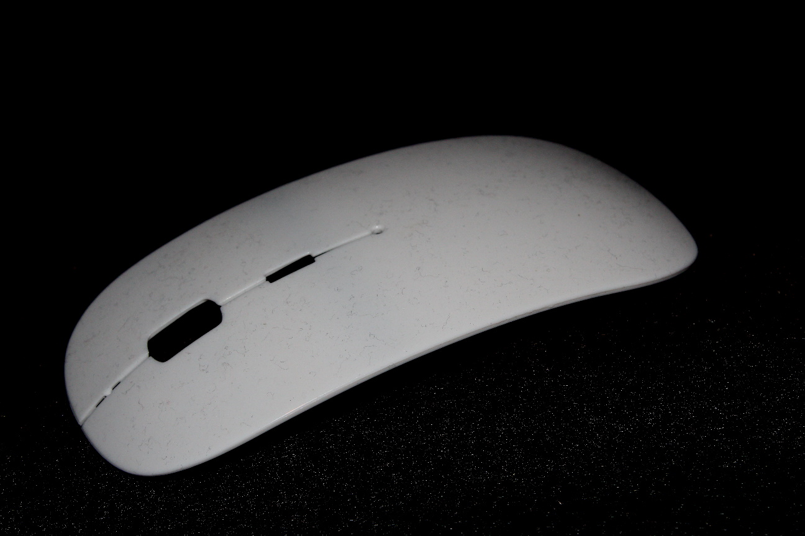
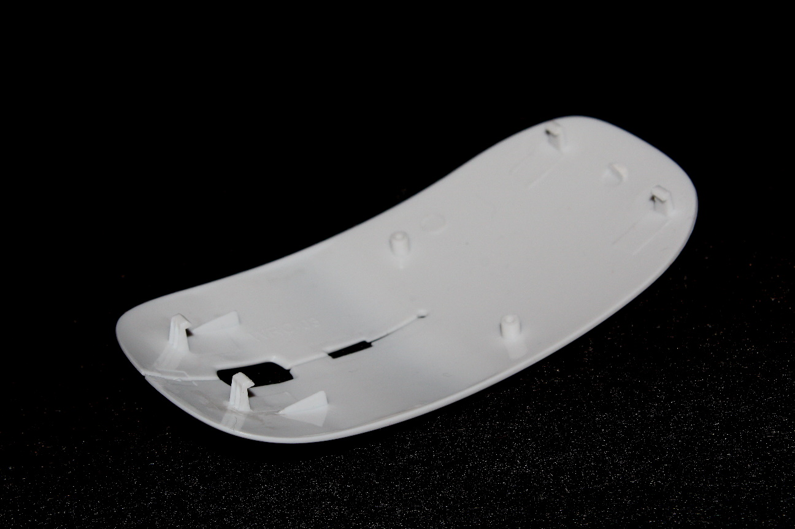
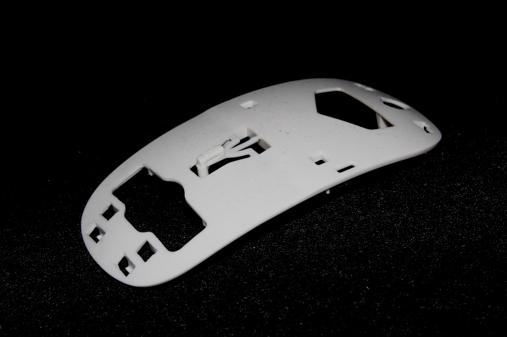
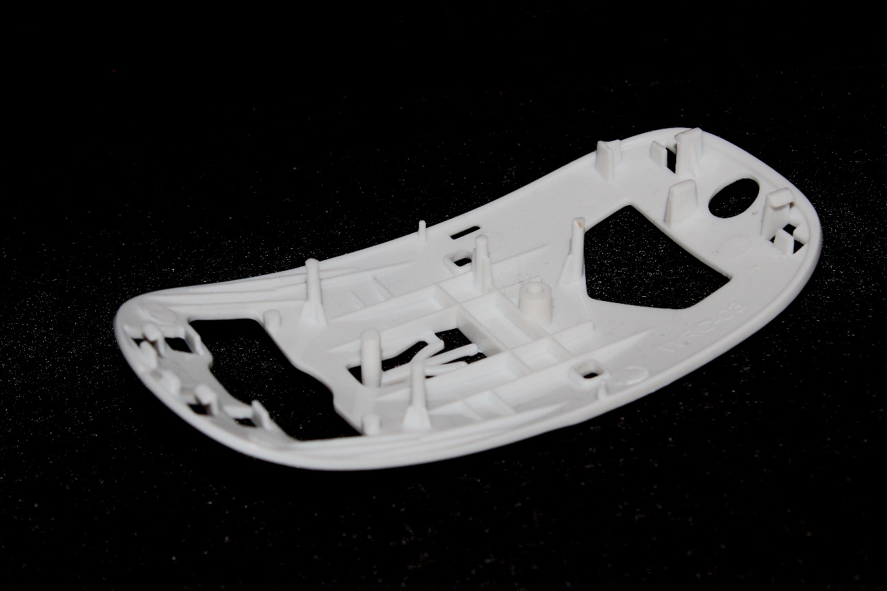
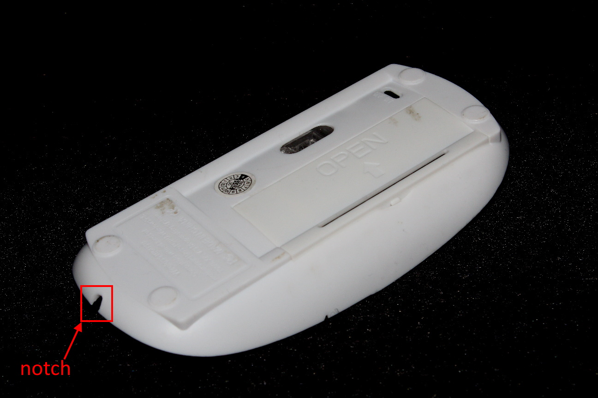
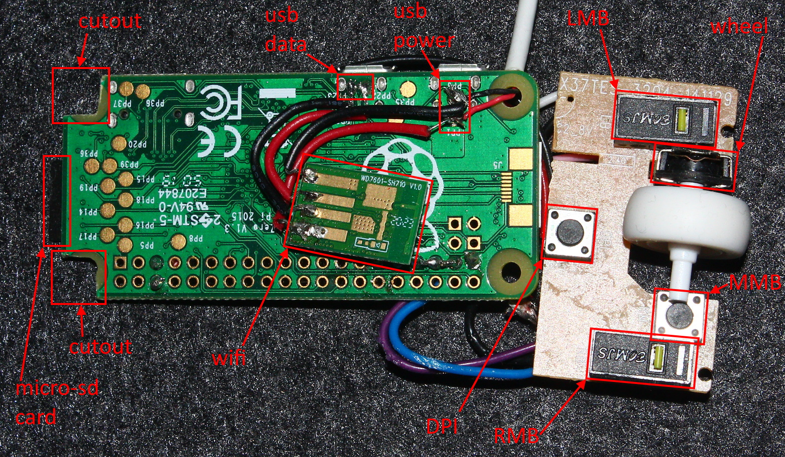
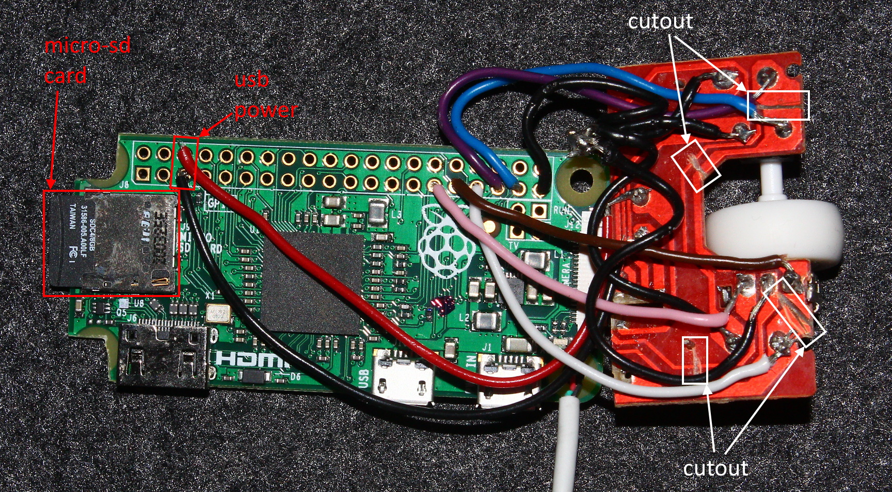

# MousePi - Not at all what it seems 

## Background
_Kodi_ has a builtin web based remote control but this is inconvenient when trying to rapidly
scroll through a long list of items (movies or songs)

## Generic Wireless Mouse
Got this off _eBay_ a few years ago for £5 and it's been gathering dust for a while

  

  

  

  

## Generic WiFi Adapter
Loads available on _eBay_ for £2 and supported by Raspbian

  

  

## Preparing the Mouse
The mouse snaps apart relatively easily and a _Dremel_ makes short work of creating space

  

  

  

  

  

  

## Raspberry Pi Zero + WiFi Adapter
Severe packaging constrains means removing the wifi adapter from it's housing
and soldering it directly to the _Raspberry Pi_.

Even then, mounting holes on the _Raspberry Pi_ had to be ground off to fit into
the mouse.

Mouse has 6 switches which can be used to control _Kodi_ but tracks had to be
cut in the mouse PCB to get independent button clicks.

  

  

## Code
_Kodi_ has a comprehensive JSON API:
* [overview](https://kodi.wiki/view/JSON-RPC_API)
* [documentation](https://kodi.wiki/view/JSON-RPC_API/v12)

which is wrapped up in a _python_ library:
* [kodi-json](https://pypi.org/project/kodi-json/)

All mouse buttons are connected to GPIO pins and monitored with:
* [gpiozero](https://gpiozero.readthedocs.io/en/stable/)

GPIO pin states are event driven and map to an input key:
* left
* right
* up
* down
* back
* select

## Further Work
* make file system read-only
* run code as a system service
